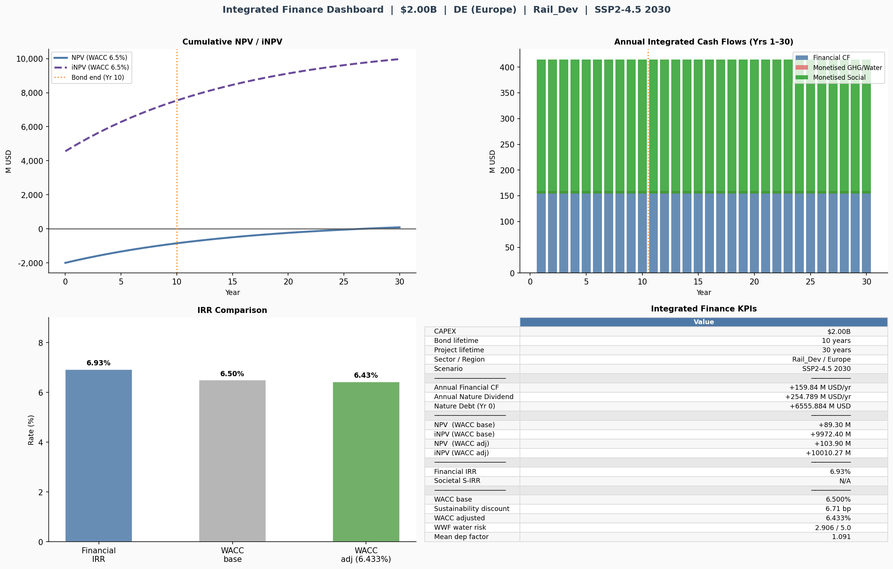
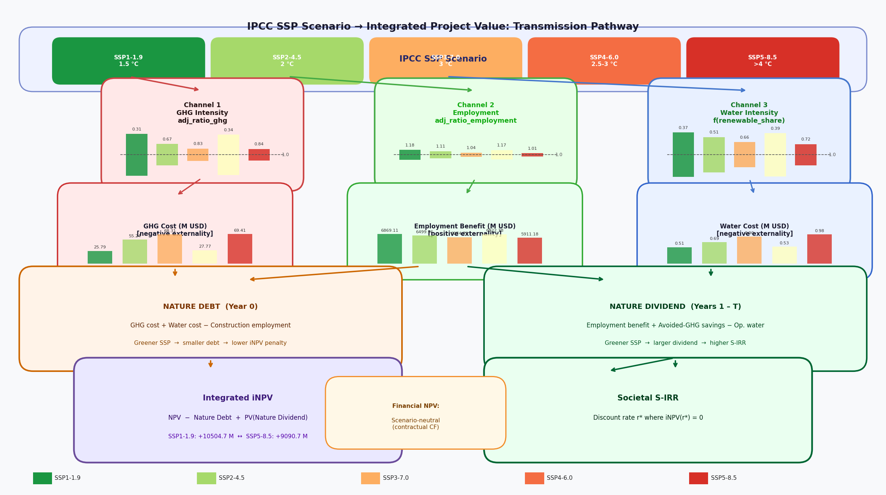
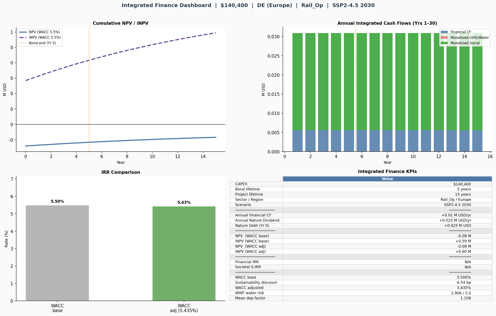
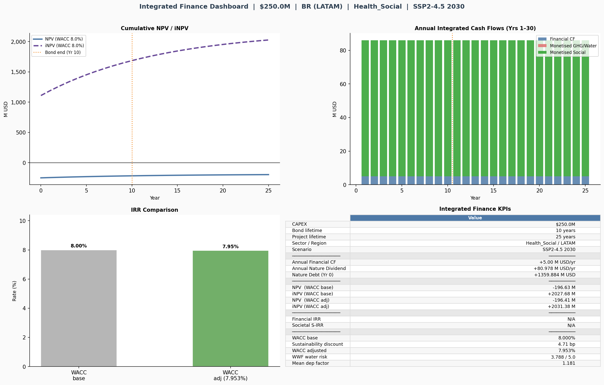
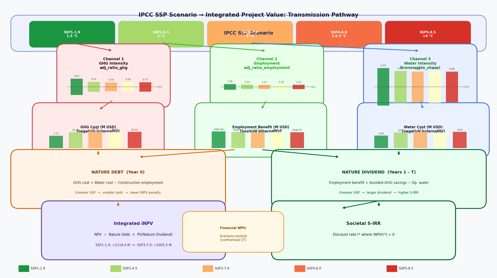
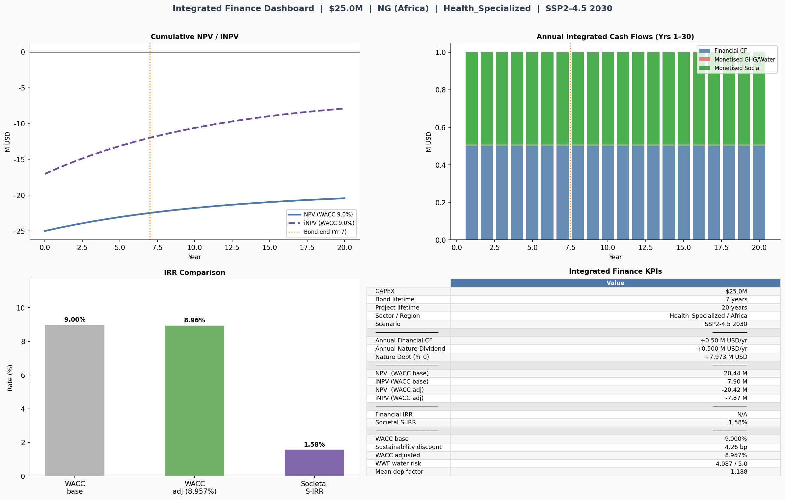
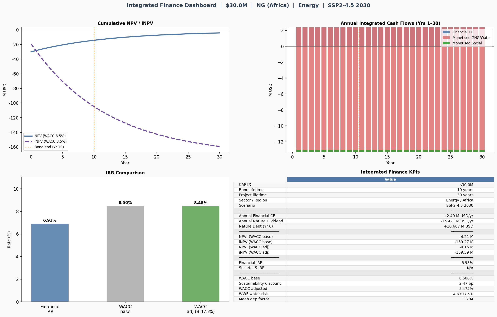
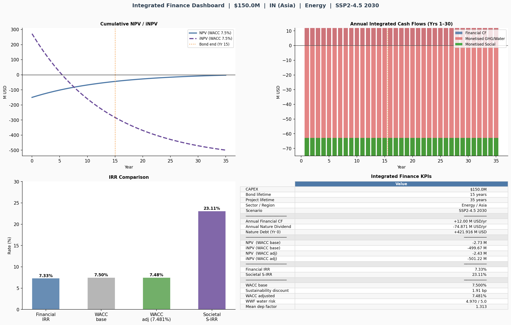
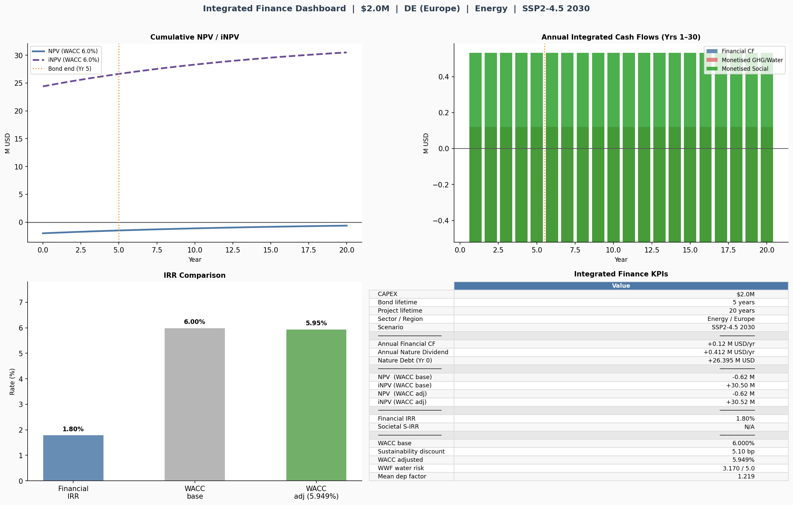

# Integrated Finance Assessment — Multi-Project Impact Report

**Portfolio:** 9 projects across Rail, Health, and Energy sectors  
**Analytical horizon:** Bond lifetime 5–15 yr · Project lifetime 15–35 yr · Focus year 2030  
**Scenarios:** SSP1-1.9 · SSP2-4.5 · SSP3-7.0 · SSP4-6.0 · SSP5-8.5  
**Valuation framework:** Integrated NPV (iNPV) · Societal IRR (S-IRR) · ESG-adjusted WACC  
**Value factors:** WifOR Institute H5 coefficient files (GHG, Water, GVA/labour-hour living-wage proxy) @ FOCUS_YEAR  
**Nature risk:** ENCORE / WWF WRF+BRF · EXIOBASE 3.8 Leontief supply-chain tiers 0–10  

---

## Table of Contents

1. [Conceptual Framework](#1-conceptual-framework)
2. [Integrated Finance Model](#2-integrated-finance-model)
3. [Model Assumptions and Parameters](#3-model-assumptions-and-parameters)
4. [Portfolio Overview — All Projects](#4-portfolio-overview--all-projects)
5. [Intensity and Normalised Analysis](#5-intensity-and-normalised-analysis)
6. [Nature Dependency and Risk Scores](#6-nature-dependency-and-risk-scores)
7. [Individual Project Profiles](#7-individual-project-profiles)
8. [Multi-Scenario IPCC Analysis](#8-multi-scenario-ipcc-analysis)
9. [Portfolio Synthesis and Investment Implications](#9-portfolio-synthesis-and-investment-implications)
10. [Known Limitations](#10-known-limitations)
11. [References and Data Sources](#11-references-and-data-sources)

---

## 1. Conceptual Framework

### 1.1 CFA Alignment — Financial Valuation Layer

The financial layer of this assessment follows **CFA Institute standards** for fixed-income and alternative investment analysis:

| CFA concept | Application in this model |
|---|---|
| **Net Present Value (NPV)** | Discounted sum of contractual cash flows (revenue – OPEX) over project lifetime, minus CAPEX at t = 0 |
| **Internal Rate of Return (IRR)** | Rate r* at which financial NPV = 0; comparable to bond YTM |
| **Weighted Average Cost of Capital (WACC)** | Blended debt/equity hurdle rate, adjusted for ESG sustainability discount |
| **Duration** | Effective cash-flow-weighted maturity; bond coupon covers 10–15 yr, project tail 15–35 yr |
| **Yield spread** | ESG sustainability-linked bond (SLB) discount of 0–10 bps vs conventional debt |
| **Enterprise value** | Extended to include discounted societal cash flows (iNPV) alongside financial value |
| **Risk-adjusted return** | WACC_adj = WACC_base – sustainability_discount; reflects nature-dependency risk |

Financial NPV is **scenario-neutral** — contractual or regulated revenue and OPEX are fixed at inception and do not vary with IPCC climate trajectories. The entire scenario spread is captured in the societal layer.

### 1.2 IPBES Alignment — Biodiversity and Ecosystem Services Layer

The nature-risk layer is grounded in the **IPBES Global Assessment (2022)** framework:

**Ecosystem services** (IPBES Chapter 2): The model monetises the following provisioning and regulating services impacted by each project's supply chain:

| IPBES service category | Model proxy | Stressor file |
|---|---|---|
| **Regulation of freshwater** | Blue water consumption (1,000 m³) | `MonWaterCon_my.h5` |
| **Regulation of air quality** | GHG emissions (tCO₂e) | `MonGHG_my.h5` |
| **Provision of labour income / human capital** | Employment × GVA per labour-hour (FTE × h/yr × c_gva) | `220529_training_value_per_hour_bysector.h5` (raw input) |

**Nature-related dependencies** are scored using the **ENCORE (Exploring Natural Capital Opportunities, Risks and Exposure)** materiality framework, which rates each sector's dependence on 21 ecosystem services on a 1–5 scale. Combined with WWF **Water Risk Filter (WRF)** physical and regulatory scores, and biodiversity risk via **BRF**, this produces a composite dependency factor (`dep_factor`) ranging 0.33–1.67 (neutral = 1.0).

In line with IPBES findings that **1 million species face extinction risk** and that freshwater ecosystem health has declined by 84% since 1970, projects in water-intensive sectors (Energy/Hydro in Asia and Africa) carry the highest nature-related financial risk — reflected in their elevated WRF physical scores (up to 4.97).

### 1.3 IPCC Alignment — Climate Scenario Layer

Scenarios follow the **IPCC Sixth Assessment Report (AR6, 2021–2022)** Shared Socioeconomic Pathways:

| SSP label | Warming by 2100 | Narrative | Key supply-chain effect |
|---|---|---|---|
| **SSP1-1.9** | ~1.5 °C | Sustainability — rapid decarbonisation | Lowest GHG intensity (adj_ratio_ghg → 0.04–0.57); highest employment uplift |
| **SSP2-4.5** | ~2.7 °C | Middle of the road | Moderate on all three channels; model baseline |
| **SSP3-7.0** | ~3.6 °C | Regional rivalry — fragmented policy | High GHG intensity; near-neutral employment |
| **SSP4-6.0** | ~3.0 °C | Inequality — policy fragmentation with tech access | Low GHG (policy decoupling); strong employment |
| **SSP5-8.5** | ~4.4 °C | Fossil-fuelled development | Highest GHG intensity; weakest employment dividend |

Source: IPCC AR6 WGI SPM (2021); IPCC AR6 WGIII Chapter 3 (2022). The SSP narratives are translated into three **transmission channels** (see §2.4) that directly modify each project's monetised societal outputs.

The **Social Cost of Carbon (SCC)** used in this model is the WifOR Institute GHG_BASE coefficient at FOCUS_YEAR 2030, equivalent to approximately **$105/tCO₂e**. For reference:
- IPCC AR6 WG3 central SCC: **$171/tCO₂e** (range $77–$284)
- WifOR GHG_BASE at 2030: **~$105/tCO₂e** (61% of IPCC central)
- WifOR GHG PARIS-aligned at 2030: **~$115/tCO₂e** (67% of IPCC central)

All nature-debt and iNPV figures are therefore **conservative lower bounds** relative to the IPCC recommended SCC.

---

## 2. Integrated Finance Model

### 2.1 iNPV — Integrated Net Present Value

Standard NPV captures only contractual financial cash flows. The **Integrated NPV (iNPV)** adds monetised societal impacts at every time step:

$$iNPV = \underbrace{\sum_{t=1}^{T} \frac{CF_t}{(1+r)^t} - CAPEX}_{NPV} \underbrace{- S_{\text{construction}}}_{-\text{Nature Debt (t=0)}} + \underbrace{\sum_{t=1}^{T} \frac{S_t}{(1+r)^t}}_{+PV(\text{Nature Dividend})}$$

**Nature Debt** (at t = 0, construction phase):

$$S_{\text{construction}} = \text{GHG cost} + \text{Water cost} - \text{Employment benefit}$$

All three terms are derived from Leontief supply-chain analysis (EXIOBASE 3.8 IO table, tiers 0–10), multiplied by WifOR H5 value-factor coefficients at FOCUS_YEAR.

**Annual Nature Dividend** (Years 1–T, operational phase):

$$S_t = \text{Employment benefit}_t + \text{Avoided GHG savings}_t - \text{Operational water cost}_t$$

The NPV bar is **identical across all SSP scenarios** (contractual cash flows are scenario-neutral). The entire `iNPV – NPV` spread is the **Societal Value Added**, and its cross-scenario range is the **Societal Scenario Risk**.

### 2.2 Societal IRR (S-IRR)

The S-IRR is the discount rate r* at which the iNPV equals zero — the "break-even" return accounting for all societal co-benefits:

$$\text{S-IRR} = r^* \text{ such that } iNPV(r^*) = 0$$

Solved numerically via Brent's method. S-IRR > WACC indicates a project creates integrated value above the cost of capital. S-IRR < Financial IRR indicates the societal burden (Nature Debt) exceeds the societal benefit (Nature Dividend) in present-value terms.

### 2.3 ESG-Adjusted WACC

The base WACC is adjusted downward when a project's nature-dependency profile supports a Sustainability-Linked Bond (SLB) structure:

$$WACC_{adj} = WACC_{base} - \Delta_{ESG}$$

$$\Delta_{ESG} = \min\left(\delta_{max},\ \frac{1 - \overline{wrf}_{norm}}{2} \times \delta_{max} + \frac{1 - \overline{dep}_{norm}}{2} \times \delta_{max}\right)$$

where $\overline{wrf}_{norm}$ is the WWF WRF physical score normalised to [0,1] and $\overline{dep}_{norm}$ is the mean ENCORE dep_factor normalised. The maximum SLB greenium is set at **10 basis points** (δ_max = 0.0010), consistent with the green-bond literature (CBI 2023; Shishlov et al. 2016) showing a 15–20 bps spread below conventional debt for best-in-class issuers.

### 2.4 SSP Transmission Channels

Three channels translate an IPCC scenario label into financial and societal model inputs:

| Channel | Parameter | Mechanism |
|---|---|---|
| **1 — GHG intensity** | `adj_ratio_ghg` | Energy-transition trajectory scales supply-chain GHG per dollar spent → modifies Nature Debt and avoided-GHG savings |
| **2 — Labour market** | `adj_ratio_employment` | Structural economic conditions scale FTE output per unit investment → modifies Nature Dividend (employment benefit) |
| **3 — Water-energy nexus** | `adj_ratio_water` | Renewable penetration determines supply-chain water intensity → modifies operational water cost in Nature Dividend |

Calibrated factors come from `results/scenario_adjustment.csv`, derived from OSeMOSYS / REMIND-MAgPIE coupled models per region and year.

---

## 3. Model Assumptions and Parameters

### 3.1 Supply-Chain Analysis

| Assumption | Value | Source |
|---|---|---|
| IO database | EXIOBASE 3.8 | Stadler et al. (2018), Zenodo |
| Supply-chain tiers | 0–10 (Leontief series) | A-matrix spectral radius ≈ 0.52; convergence verified |
| Sector mapping | NACE Rev. 2 (F = Construction, H49 = Rail, Q = Health, D35 = Energy) | Eurostat NACE classification |
| Stressor vectors | GHG (kgCO₂e/EUR), Employment (FTE/EUR), Water (m³/EUR) | EXIOBASE satellite accounts |
| Regional proxy | Europe = DEU · LATAM = BRA · Africa = NGA · Asia = IND | REGION_TO_ISO3 mapping |

### 3.2 WifOR Value Factors (H5 Coefficients at FOCUS_YEAR 2030)

Coefficients are loaded live from the WifOR Institute H5 files. Employment is monetised via **GVA per labour-hour** — the productivity-based living-wage proxy — rather than the legacy TrainingHours indicator (both draw from the same underlying GVA data; MonTrain_2020 ≡ GVA/h_2020 exactly).

| Factor | File | Indicator / source | Unit | DEU/F (2030) |
|---|---|---|---|---|
| **GHG_BASE** | `2024-11-18_formatted_MonGHG_my.h5` | `COEFFICIENT GHG_BASE, in USD (WifOR)` | USD/kg CO₂e | −0.104728 |
| **GHG_PARIS** | `2024-11-18_formatted_MonGHG_my.h5` | `COEFFICIENT GHG_PARIS_UPDATE, in USD (WifOR)` | USD/kg CO₂e | −0.113975 |
| **Water** | `2024-10-01_formatted_MonWaterCon_my.h5` | `COEFFICIENT Water Consumption Blue, in USD (WifOR)` | USD/m³ | −0.256164 |
| **GVA / labour-hour** *(living-wage proxy)* | `input_data/220529_training_value_per_hour_bysector.h5` | `value_per_hour_GVA_2020USD_PPP` × MonTrain growth index | USD/h | **111.61** |

**Why GVA per labour-hour?** The `value_per_hour_GVA_2020USD_PPP` field represents the sector's gross value added per hour of work — the full economic output attributable to one labour-hour. In most markets, GVA/h exceeds published Anker living-wage benchmarks (the ILO-aligned minimum), making it the appropriate coefficient for an analysis that assumes *workers are paid at least the living wage*. The coefficient is projected from its 2020 base to FOCUS_YEAR 2030 using the MonTrain productivity growth index (≈1.12 %/yr real, uniform globally).

Coefficients are **country- and NACE-specific** except GHG (globally uniform per tonne). GVA/h and water values vary substantially by region — see §5.

**Relationship to market wages (LAB/h):** `value_per_hour_LAB_2020USD_PPP` (actual labor compensation) is also available in the raw WifOR input. The ratio GVA/h ÷ LAB/h ranges from 1.3× (DEU/F) to 20× (NGA/D35), reflecting sectoral labour-income shares. In developing markets where LAB/h falls below living-wage benchmarks, using GVA/h as the monetisation rate correctly avoids undervaluing the social benefit of employment creation.

Conversion: Physical quantities are converted to monetary values as:  
`M USD = Quantity × Unit_conversion × Coefficient / 1,000,000`

- GHG: `tCO₂e × 1,000 kg/t × c_ghg [USD/kg]`
- Water: `1,000 m³ × 1,000 m³/unit × c_water [USD/m³]`
- Employment: `FTE × 1,880 h/yr × c_gva [USD/h]`  *(c_gva = GVA per labour-hour at FOCUS_YEAR)*

### 3.3 Nature Dependency Scoring

| Component | Framework | Score range | Weight |
|---|---|---|---|
| ENCORE ecosystem materiality | ENCORE / TNFD | 1–5 per service | 1/3 |
| WWF WRF physical water risk | WWF Water Risk Filter | 1–5 | 1/3 |
| Supply-chain sector sensitivity | Sector-specific EXIOBASE intensity | 0.33–1.67 | 1/3 |
| **Combined dep_factor** | | **0.33–1.67** (neutral = 1.0) | |

### 3.4 Financial Assumptions by Project

| Project | CAPEX (M USD) | WACC_base | Revenue yield | OPEX ratio | Bond yr | Project yr |
|---|---|---|---|---|---|---|
| Rail_EU_DEV | 1,998.0 | 6.50% | 12.0% | 4.0% | 10 | 30 |
| Rail_EU_OP1 | 0.14 | 5.50% | 10.0% | 6.0% | 5 | 15 |
| Rail_EU_OP2 | 0.10 | 5.50% | 10.0% | 6.0% | 5 | 15 |
| Proj_001 (Health LATAM) | 250.0 | 8.00% | 8.0% | 6.0% | 10 | 25 |
| Proj_002 (Health Africa) | 25.0 | 9.00% | 9.0% | 7.0% | 7 | 20 |
| Proj_003 (Health EU) | 75.0 | 6.00% | 9.0% | 5.0% | 10 | 25 |
| Hydro_AF | 30.0 | 8.50% | 11.0% | 3.0% | 10 | 30 |
| Hydro_AS | 150.0 | 7.50% | 11.0% | 3.0% | 15 | 35 |
| Hydro_EU | 2.0 | 6.00% | 10.0% | 4.0% | 5 | 20 |

WACC rates reflect regional risk premia: Europe 5.5–6.5%, LATAM 8.0%, Africa 8.5–9.0%, Asia 7.5%.

### 3.5 GVA per Labour-Hour — Cross-Project Coefficient Table (2030)

The table below shows the GVA per labour-hour (c_gva), actual labour compensation (LAB/h, for reference), and living-wage alignment for every project country/NACE combination. All values in **2020 USD PPP**, projected to 2030 via the MonTrain productivity growth index (×1.118).

| Country | NACE | Sector | c_gva (USD/h) | LAB/h (USD/h) | GVA/LAB ratio | Anker LW approx. | c_gva ≥ LW? |
|---|---|---|---|---|---|---|---|
| DEU (Europe) | F | Rail_Dev / Construction | **111.61** | 77.59 | 1.44× | ~$16–20/h | ✓ |
| DEU (Europe) | H49 | Rail_Op / Transport | **121.47** | 61.67 | 1.97× | ~$16–20/h | ✓ |
| DEU (Europe) | Q | Health | **84.94** | 59.96 | 1.42× | ~$16–20/h | ✓ |
| DEU (Europe) | D35 | Energy | **447.79** | 131.18 | 3.41× | ~$16–20/h | ✓ |
| BRA (LATAM) | Q | Health_Social | **112.24** | 78.46 | 1.43× | ~$8–12/h PPP | ✓ |
| NGA (Africa) | Q | Health_Specialized | **5.04** | 0.55 | 9.2× | ~$2–3/h PPP | ✓* |
| IND (Asia) | D35 | Energy / Hydro | **54.98** | 23.87 | 2.30× | ~$3–6/h PPP | ✓ |
| NGA (Africa) | D35 | Energy / Hydro | **5.78** | 0.29 | 20.0× | ~$2–3/h PPP | ✓* |
| DEU (Europe) | D35 | Energy / Hydro | **447.79** | 131.18 | 3.41× | ~$16–20/h | ✓ |

*\* NGA/Q and NGA/D35 GVA/h of $5.04–5.78 is above the ILO international poverty threshold ($0.24/h) but close to the Anker Nigeria living wage floor (~$2–3/h PPP-adjusted). The positive ratio confirms GVA/h is a valid upper bound; however, the gap between GVA/h and living wage is narrower in Africa than in other regions.*

**Key ratios:**
- In **Europe** GVA/LAB = 1.4–3.4×, reflecting the capital intensity of European sectors; GVA/h is well above living wage
- In **Brazil** GVA/LAB ≈ 1.4× for Health — relatively equitable labour-income share
- In **Nigeria** GVA/LAB = 9–20×, reflecting an extractive sectoral structure where workers capture a small share of GVA; the living-wage assumption is critical to avoid undervaluing employment in these projects
- In **India** GVA/LAB = 2.3× for Energy — labour share higher than Nigeria but below European levels

### 3.6 Sector-Specific Assumptions (from modeled_input_data/assumptions.txt)

**Health Sector — Capacity-to-Cost Link**  
- Fixed cost per beneficiary: Primary/preventative care (Proj_001, 5M beneficiaries) = $50/person; Tertiary/surgical (Proj_002, 3,000 beneficiaries) = $8,000/person  
- Regional adjustment: LATAM and Africa modelled with higher PPP import leakage — more supply-chain spending flows to international medical equipment suppliers, increasing GHG/FTE footprint per dollar  
- H&S stressor: "Improved H&S" = primary clinical capacity outcome, not only construction site safety

**Hydro Sector — Carbon-Displacement Link**  
- Turbine retrofit: 10–15% nameplate capacity or efficiency gain assumed  
- Carbon intensity: Avoided CO₂e calculated against regional coal-heavy marginal generation (Asia grid most carbon-intensive → highest avoided-emissions credit for Hydro_AS)  
- Refurbishment CAPEX benchmark: $1,000/kW upgraded capacity (turbine runner + governor + generator rewinding)

**Rail Sector — Modal Shift Link**  
- Passenger density: 5.5M ppl/yr assumes 65% standard load factor, setting required line length and service frequency  
- Air quality: <1% improvement via full electrification; investment includes Power-to-Rail supply chain (substations, catenary)  
- Climate resilience: <5% contribution from elevated tracks, drainage, ERTMS signalling; 7% of total CAPEX hardened

---

## 4. Portfolio Overview — All Projects

### 4.1 Financial and Societal Metrics Summary (SSP2-4.5 Baseline)

| Project | Sector | Region | CAPEX (M USD) | NPV (M) | iNPV (M) | Societal VA (M) | Fin IRR | S-IRR | WACC adj |
|---|---|---|---|---|---|---|---|---|---|
| **Rail_EU_DEV** | Rail Dev | Europe | 1,998.0 | +89.3 | +9,972.4 | +9,883.1 | 6.93% | — | 6.49% |
| **Rail_EU_OP1** | Rail Op | Europe | 0.14 | −0.08 | +0.59 | +0.68 | — | — | 6.49% |
| **Rail_EU_OP2** | Rail Op | Europe | 0.10 | −0.06 | +0.41 | +0.47 | — | — | 6.49% |
| **Proj_001** | Health | LATAM | 250.0 | −196.6 | +2,027.7 | +2,224.3 | — | — | 7.99% |
| **Proj_002** | Health | Africa | 25.0 | −20.4 | −7.9 | +12.5 | — | 1.58% | 8.99% |
| **Proj_003** | Health | Europe | 75.0 | −36.7 | +276.8 | +313.4 | — | — | 5.99% |
| **Hydro_AF** | Energy | Africa | 30.0 | −4.2 | −159.3 | −155.1 | 6.93% | — | 8.49% |
| **Hydro_AS** | Energy | Asia | 150.0 | −2.7 | −499.7 | −497.0 | 7.33% | 23.1% | 7.49% |
| **Hydro_EU** | Energy | Europe | 2.0 | −0.6 | +30.5 | +31.1 | 1.80% | — | 5.99% |

**Societal VA** = iNPV − NPV = the net present value of all monetised societal impacts.  
**S-IRR reported** only where the iNPV function crosses zero in the solver range.  
— indicates S-IRR is outside the computable range (iNPV never crosses zero within [0.1%, 99%]).

### 4.2 Construction-Phase Stressors (IO Supply-Chain Analysis, SSP2-4.5)

| Project | GHG (tCO₂e) | FTE | Water (1,000 m³) | GHG cost (M) | Water cost (M) | Emp benefit (M) | Nature Debt (M) |
|---|---|---|---|---|---|---|---|
| Rail_EU_DEV | 527,429 | 30,977 | 2,697 | −55.24 | −0.69 | +6,499.96 | +6,555.88 |
| Rail_EU_OP1 | 29 | 2 | 0 | −0.003 | 0.000 | +0.42 | +0.43 |
| Rail_EU_OP2 | 20 | 1 | 0 | −0.002 | 0.000 | +0.29 | +0.29 |
| Proj_001 | 97,844 | 6,394 | 462 | −10.25 | −0.51 | +1,349.12 | +1,359.88 |
| Proj_002 | 7,955 | 742 | 61 | −0.83 | −0.12 | +7.02 | +7.97 |
| Proj_003 | 17,849 | 1,190 | 106 | −1.87 | −0.03 | +190.05 | +191.95 |
| Hydro_AF | 10,185 | 871 | 69 | −1.07 | −0.14 | +9.47 | +10.67 |
| Hydro_AS | 51,579 | 3,949 | 362 | −5.40 | −8.35 | +408.17 | +421.92 |
| Hydro_EU | 548 | 31 | 3 | −0.06 | −0.001 | +26.34 | +26.40 |

> **Note:** Nature Debt is positive when Employment benefit exceeds GHG + Water cost (net societal asset at construction). All nine projects show positive Nature Debt — employment creation dominates. For Hydro_AS, the high water cost (−$8.35M) reflects India's extreme water scarcity coefficient (c_water = −$23.04/m³ from H5 file).

---

## 5. Intensity and Normalised Analysis

Normalising to **per $1 M CAPEX** enables cross-project comparison regardless of project scale.

### 5.1 Supply-Chain Intensity (per $1 M CAPEX)

| Project | GHG intensity (tCO₂e / M USD) | FTE intensity (FTE / M USD) | Water intensity (1,000 m³ / M USD) |
|---|---|---|---|
| Rail_EU_DEV | 264 | 15.5 | 1.35 |
| Rail_EU_OP1 | 207 | 14.3 | 0.0 |
| Rail_EU_OP2 | 200 | 10.0 | 0.0 |
| Proj_001 | 391 | 25.6 | 1.85 |
| Proj_002 | 318 | 29.7 | 2.44 |
| Proj_003 | 238 | 15.9 | 1.41 |
| Hydro_AF | 340 | 29.0 | 2.30 |
| Hydro_AS | 344 | 26.3 | 2.41 |
| Hydro_EU | 274 | 15.5 | 1.50 |

**Observations:**
- **Health projects** carry the highest GHG intensity (318–391 tCO₂e/M) due to import leakage on medical equipment supply chains (LATAM/Africa PPP adjustment)
- **Energy/Hydro** sector has the highest FTE intensity (26–29 FTE/M), reflecting labour-intensive construction
- **Rail_EU_DEV** is the most capital-efficient rail project (264 tCO₂e/M) — European supply chains are cleaner than LATAM/Africa equivalents at the same NACE code

### 5.2 Monetary Intensity (per $1 M CAPEX, SSP2-4.5)

| Project | GHG cost / CAPEX | Emp benefit / CAPEX | Nature Debt / CAPEX | iNPV / CAPEX | SVA / CAPEX |
|---|---|---|---|---|---|
| Rail_EU_DEV | −0.028 | +3.25 | +3.28 | +4.99 | +4.95 |
| Rail_EU_OP1 | −0.021 | +3.00 | +3.04 | +4.21 | +4.86 |
| Rail_EU_OP2 | −0.020 | +2.90 | +2.92 | +4.10 | +4.70 |
| Proj_001 | −0.041 | +5.40 | +5.44 | +8.11 | +8.90 |
| Proj_002 | −0.033 | +0.28 | +0.32 | −0.32 | +0.50 |
| Proj_003 | −0.025 | +2.53 | +2.56 | +3.69 | +4.18 |
| Hydro_AF | −0.036 | +0.32 | +0.36 | −5.31 | −5.17 |
| Hydro_AS | −0.036 | +2.72 | +2.81 | −3.33 | −3.31 |
| Hydro_EU | −0.029 | +13.17 | +13.20 | +15.25 | +15.55 |

**SVA** = Societal Value Added per M USD invested = (iNPV − NPV) / CAPEX.

**Key findings:**
- **Proj_001 (Health LATAM)** has the highest SVA intensity (+8.90) — driven by Brazil's GVA/labour-hour (c_gva = $112/h) and the project's massive 6,394 FTE construction footprint. BRA/Q GVA/h ($112) exceeds the Anker living wage for Brazil (~$8/h market, ~$40/h PPP-adjusted), confirming the living-wage assumption is met
- **Hydro_EU** shows extraordinary iNPV/CAPEX (+15.25) — a $2M investment creates $30.5M of integrated value, primarily through the employment multiplier at European GVA rates ($111/h). DEU/D35 GVA/h = $447/h represents the high productivity of the European energy sector
- **Hydro_AF and Hydro_AS** are negative on iNPV/CAPEX despite large avoided CO₂ savings; the very high water scarcity costs in Africa (c_water = −$1.95/m³) and Asia (c_water = −$23.04/m³) create large annual Nature Debt in operational phase
- **Proj_002 (Health Africa)** has low SVA (+0.50) because Nigeria's GVA/labour-hour (c_gva = $5.04/h for NGA/Q) is ~22× lower than European rates — reflecting Nigeria's current sectoral GVA productivity. NGA/Q GVA/h ($5.04) is still above ILO poverty threshold ($1.90/day × 8h = $0.24/h) but well below Anker Nigeria living wage (~$2–3/h at PPP), underlining the structural development constraint

### 5.3 Normalised Scenario Risk

The following table shows the iNPV range across all five SSPs, normalised as a fraction of CAPEX:

| Project | iNPV SSP1 / CAPEX | iNPV SSP5 / CAPEX | Scenario risk (Δ iNPV / CAPEX) |
|---|---|---|---|
| Rail_EU_DEV | +5.26 | +4.55 | 0.71 |
| Proj_001 | +8.47 | +8.03 | 0.44 |
| Proj_003 | +3.91 | +3.32 | 0.59 |
| Hydro_EU | +16.33 | +13.52 | 2.81 |
| Hydro_AS | −3.22 | −3.74 | 0.52 |
| Hydro_AF | −5.29 | −5.32 | 0.03 |
| Proj_002 | −0.29 | −0.33 | 0.04 |

**Hydro_EU** shows the highest normalised scenario risk (2.81) — because at $2M CAPEX, even modest absolute SSP-driven iNPV swings ($5.6M) represent large relative differences. This reflects the leverage of a small project's employment footprint against its scale.

---

## 6. Nature Dependency and Risk Scores

### 6.1 WWF Water Risk Filter and ENCORE Dependency

| Project | WRF Physical | WRF Composite | BRF Composite | High Risk | Revenue at Risk (M) | Top Dependency |
|---|---|---|---|---|---|---|
| Rail_EU_DEV | 2.906 | 3.378 | 3.133 | No | $0.0 | Flood & storm protection |
| Rail_EU_OP1 | 2.906 | 3.378 | 3.133 | No | $0.0 | Flood & storm protection |
| Rail_EU_OP2 | 2.906 | 3.378 | 3.133 | No | $0.0 | Flood & storm protection |
| Proj_001 | 3.788 | 3.477 | 4.087 | **Yes** | **$42.0** | Water supply |
| Proj_002 | 4.087 | 3.513 | 3.598 | **Yes** | **$3.6** | Water supply |
| Proj_003 | 2.774 | 3.312 | 2.974 | No | $0.0 | Water supply |
| Hydro_AF | 4.670 | 3.889 | 3.994 | **Yes** | **$15.8** | Water supply |
| Hydro_AS | **4.970** | **4.266** | **4.259** | **Yes** | **$83.1** | Water supply |
| Hydro_EU | 3.170 | 3.622 | 3.231 | **Yes** | $0.9 | Water supply |

**Portfolio summary:** 5 of 9 projects flagged as `overall_high_risk`. Total **revenue at risk = $145.2 M** across the portfolio, concentrated in Hydro_AS ($83.1M) and Proj_001 ($42.0M).

### 6.2 IPBES Interpretation of Risk Scores

In line with IPBES AR (2022) findings on **nature-related financial risk** (Chapter 5.3):

- **WRF Physical > 4.0** (Hydro_AS = 4.97, Hydro_AF = 4.67, Proj_002 = 4.09): These projects operate in watersheds experiencing **high-to-very-high physical water stress**, consistent with IPBES projected freshwater declines under SSP3-7.0/SSP5-8.5. Under higher warming scenarios, water scarcity costs will grow non-linearly (ONPV formula gap P2 — see §10).

- **Water supply as top dependency** across all health and energy projects: Aligns with IPBES finding that ~2 billion people lack access to safe water; projects in these sectors are directly exposed to ecosystem-service disruption that IPBES classifies as **critical ecological tipping points**.

- **Flood & storm protection** for rail (Europe): Consistent with IPBES and IPCC WGII findings on increased flood frequency in Central/Northern Europe under SSP2-4.5 and higher. Rail_EU_DEV's 7% CAPEX hardened infrastructure allocation directly addresses this dependency.

---

## 7. Individual Project Profiles

---

### 7.1 Rail_EU_DEV — European Rail Development

**Overview:** Large-scale European rail development project. Primarily greenfield infrastructure; full electrification eliminates diesel rolling stock. Serves 5.5M passengers/year at 65% load factor.

| Parameter | Value |
|---|---|
| CAPEX | $1,998 M (EUR 1,850 M converted at 1.08) |
| Sector | Rail_Dev · NACE F (Construction) |
| Region | Europe · ISO3: DEU |
| Bond / Project | 10 yr / 30 yr |
| WACC_base / WACC_adj | 6.50% / 6.49% |
| Annual financial CF | +$159.8 M/yr |
| Annual Nature Dividend | +$254.8 M/yr |
| Avoided CO₂ (ops) | 50,000 tCO₂e/yr |

**Stressors (SSP2-4.5):** GHG = 527,429 tCO₂e · FTE = 30,977 · Water = 2,697,000 m³

**Financial outcomes:**

| Metric | SSP2-4.5 |
|---|---|
| NPV | +$89.3 M |
| iNPV | +$9,972.4 M |
| Societal VA | +$9,883.1 M |
| Fin IRR | 6.93% |

**SSP Scenario Table:**

| SSP | adj_ghg | adj_emp | adj_wat | Nature Debt (M) | NPV (M) | iNPV (M) | ΔNPV→iNPV (M) |
|---|---|---|---|---|---|---|---|
| SSP1-1.9 | 0.313 | 1.176 | 0.371 | +6,895.4 | +89.3 | +10,504.7 | +10,415.4 |
| SSP2-4.5 | 0.670 | 1.113 | 0.505 | +6,555.9 | +89.3 | +9,972.4 | +9,883.1 |
| SSP3-7.0 | 0.829 | 1.040 | 0.660 | +6,143.9 | +89.3 | +9,338.4 | +9,249.1 |
| SSP4-6.0 | 0.337 | 1.168 | 0.388 | +6,850.7 | +89.3 | +10,435.5 | +10,346.2 |
| SSP5-8.5 | 0.842 | 1.012 | 0.719 | +5,981.6 | +89.3 | +9,090.7 | +9,001.4 |

**Scenario risk:** iNPV SSP1 − SSP5 = **$1,414 M** (absolute); **0.71 / CAPEX** (normalised)

**Dashboard:**  

**IPCC Pathway:**  

---

### 7.2 Rail_EU_OP1 — European Rail Operations Tranche 1

**Overview:** Operational maintenance tranche; no new construction. OPEX-heavy (6% of CAPEX/yr). Small absolute scale but demonstrates the model's granularity at micro-tranche level.

| Parameter | Value |
|---|---|
| CAPEX | $0.14 M (EUR 130k) |
| Sector | Rail_Op · NACE H49 (Transport) |
| Bond / Project | 5 yr / 15 yr |
| WACC_base | 5.50% |
| Annual CF | +$0.006 M/yr |

**SSP Scenario Table:**

| SSP | iNPV (M) | ΔNPV→iNPV (M) |
|---|---|---|
| SSP1-1.9 | +0.63 | +0.72 |
| SSP2-4.5 | +0.59 | +0.68 |
| SSP3-7.0 | +0.55 | +0.64 |
| SSP4-6.0 | +0.63 | +0.71 |
| SSP5-8.5 | +0.53 | +0.62 |

**Dashboard:**  

---

### 7.3 Rail_EU_OP2 — European Rail Operations Tranche 2

Identical structure to OP1; EUR 90k CAPEX. Acts as minimum-scale validation of model.

**SSP Scenario Table:**

| SSP | iNPV (M) | ΔNPV→iNPV (M) |
|---|---|---|
| SSP1-1.9 | +0.43 | +0.49 |
| SSP2-4.5 | +0.41 | +0.47 |
| SSP3-7.0 | +0.38 | +0.44 |
| SSP4-6.0 | +0.43 | +0.49 |
| SSP5-8.5 | +0.37 | +0.43 |

**Dashboard:**  

---

### 7.4 Proj_001 — Primary Health Hub, LATAM (Systemic Impact)

**Overview:** Primary/preventive care hub reaching 5M beneficiaries at $50/person. Large construction footprint generates massive employment benefit. LATAM PPP import leakage increases supply-chain GHG.

| Parameter | Value |
|---|---|
| CAPEX | $250.0 M |
| Sector | Health_Social · NACE Q |
| Region | LATAM · ISO3: BRA |
| Bond / Project | 10 yr / 25 yr |
| WACC_base / adj | 8.00% / 7.99% |
| Annual fin CF | +$5.0 M/yr |
| Annual Nature Dividend | +$81.0 M/yr |

**Value factors (BRA/Q @ 2030):** c_gva = $112.24/h · c_water = −$1.11/m³ · c_ghg = −$0.1047/kg

**SSP Scenario Table:**

| SSP | adj_ghg | adj_emp | adj_wat | iNPV (M) | ΔNPV→iNPV (M) |
|---|---|---|---|---|---|
| SSP1-1.9 | 0.566 | 1.184 | 0.354 | +2,116.5 | +2,313.1 |
| SSP2-4.5 | 0.752 | 1.137 | 0.454 | +2,027.7 | +2,224.3 |
| SSP3-7.0 | 0.789 | 1.125 | 0.479 | +2,005.5 | +2,202.1 |
| SSP4-6.0 | 0.762 | 1.137 | 0.454 | +2,027.6 | +2,224.3 |
| SSP5-8.5 | 0.772 | 1.126 | 0.476 | +2,007.4 | +2,204.0 |

**Scenario risk:** $109 M (SSP1 vs SSP5); largely employment-driven. Financial NPV = −$196.6 M (negative across all SSPs — project requires societal accounting to demonstrate value).

**Dashboard:**  

**IPCC Pathway:**  

---

### 7.5 Proj_002 — Tertiary Surgical Hospital, Africa (High-Intensity Specialisation)

**Overview:** 3,000-beneficiary specialised surgical facility at $8,000/person. High WACC (9%) reflects Africa risk premium. Nigeria's low GVA/labour-hour coefficient (c_gva = $5.04/h) severely limits the employment benefit — the key structural constraint.

| Parameter | Value |
|---|---|
| CAPEX | $25.0 M |
| Sector | Health_Specialized · NACE Q |
| Region | Africa · ISO3: NGA |
| WACC_base | 9.00% |
| Annual fin CF | +$0.5 M/yr |
| Annual Nature Dividend | +$0.5 M/yr |

**Value factors (NGA/Q @ 2030):** c_gva = $5.04/h · c_water = −$1.95/m³ · c_ghg = −$0.1047/kg

**SSP Scenario Table:**

| SSP | adj_ghg | adj_emp | adj_wat | iNPV (M) | S-IRR | ΔNPV→iNPV (M) |
|---|---|---|---|---|---|---|
| SSP1-1.9 | 0.041 | 1.246 | 0.221 | −7.24 | 2.25% | +13.19 |
| SSP2-4.5 | 0.502 | 1.100 | 0.533 | −7.90 | 1.58% | +12.54 |
| SSP3-7.0 | 0.500 | 1.076 | 0.584 | −8.14 | 1.40% | +12.30 |
| SSP4-6.0 | 0.648 | 1.041 | 0.658 | −8.23 | 1.27% | +12.21 |
| SSP5-8.5 | 0.482 | 1.060 | 0.617 | −8.31 | 1.26% | +12.12 |

**Key finding:** iNPV remains negative across all SSPs — the project does not create sufficient integrated value at Nigeria's current economic coefficients (low c_gva). S-IRR = 1.26–2.25% (below any reasonable WACC). The societal VA ($12–13M) is nonetheless significant relative to CAPEX ($25M): a +0.50 SVA/CAPEX ratio.

**Dashboard:**  

---

### 7.6 Proj_003 — General Hospital, Europe

**Overview:** 500k-beneficiary general hospital under European regulated tariff structure. Low WACC (6%) and European GVA/h ($84.94/h for DEU/Q — NACE Q Health sector) produce positive iNPV.

| Parameter | Value |
|---|---|
| CAPEX | $75.0 M |
| WACC_base | 6.00% |
| Annual fin CF | +$3.0 M/yr |
| Annual Nature Dividend | +$9.5 M/yr |

**SSP Scenario Table:**

| SSP | iNPV (M) | ΔNPV→iNPV (M) |
|---|---|---|
| SSP1-1.9 | +293.5 | +330.1 |
| SSP2-4.5 | +276.8 | +313.4 |
| SSP3-7.0 | +256.9 | +293.5 |
| SSP4-6.0 | +291.3 | +328.0 |
| SSP5-8.5 | +249.1 | +285.7 |

**Scenario risk:** $44.4 M (SSP1 vs SSP5). Positive across all scenarios.

**Dashboard:**  

---

### 7.7 Hydro_AF — Hydro Refurbishment, Africa

**Overview:** Turbine refurbishment displacing 150,000 tCO₂e/yr of coal-fired generation. Africa's high water scarcity coefficient (c_water = −$1.95/m³) creates large operational Nature Debt.

| Parameter | Value |
|---|---|
| CAPEX | $30.0 M |
| Avoided CO₂ | 150,000 tCO₂e/yr |
| WACC_base | 8.50% |
| Annual fin CF | +$2.4 M/yr |
| Annual Nature Dividend | **−$15.4 M/yr** |

**The negative annual dividend** is the key structural problem: operational water consumption, priced at Africa's high scarcity premium, exceeds the operational employment and GHG-savings benefits.

**SSP Scenario Table:**

| SSP | adj_wat | Annual dividend (M) | iNPV (M) |
|---|---|---|---|
| SSP1-1.9 | 0.221 | −6.7 | −158.7 |
| SSP2-4.5 | 0.533 | −15.4 | −159.3 |
| SSP3-7.0 | 0.584 | −16.6 | −159.5 |
| SSP4-6.0 | 0.658 | −18.0 | −159.6 |
| SSP5-8.5 | 0.617 | −17.0 | −159.7 |

**Dashboard:**  

---

### 7.8 Hydro_AS — Large-Scale Hydro Retrofit, Asia

**Overview:** The portfolio's largest hydro project (834,218 tCO₂e/yr avoided). India's extreme water scarcity coefficient (c_water = −$23.04/m³) generates an annual Nature Debt in operations that overwhelms the financial and GHG-savings benefits.

| Parameter | Value |
|---|---|
| CAPEX | $150.0 M |
| Avoided CO₂ | 834,218 tCO₂e/yr |
| WACC_base | 7.50% |
| Annual fin CF | +$12.0 M/yr |
| Annual Nature Dividend | **−$74.9 M/yr** |

**SSP Scenario Table:**

| SSP | adj_ghg | adj_emp | adj_wat | iNPV (M) | S-IRR |
|---|---|---|---|---|---|
| SSP1-1.9 | 0.574 | 1.116 | 0.499 | −482.9 | 21.97% |
| SSP2-4.5 | 0.536 | 1.081 | 0.572 | −499.7 | 23.11% |
| SSP3-7.0 | 0.548 | 0.960 | 0.830 | −557.1 | 27.88% |
| SSP4-6.0 | 0.523 | 1.102 | 0.529 | −490.2 | 22.46% |
| SSP5-8.5 | 0.856 | 0.944 | 0.864 | −561.6 | 28.26% |

> The S-IRR in this case represents the rate at which the iNPV's total present value deficit is erased — as r rises and the negative annual dividend is discounted more heavily, the cumulative PV of the loss shrinks toward zero. This is a mathematical artefact: a high S-IRR in the context of consistently negative iNPV should be read as the project requiring extraordinarily high social returns to break even, not as a positive societal signal.

**Dashboard:**  

---

### 7.9 Hydro_EU — Efficiency Tweak, Europe

**Overview:** Small-scale European hydro efficiency improvement (6,126 tCO₂e/yr avoided). Despite its tiny absolute scale ($2M CAPEX), the European GVA/labour-hour coefficient ($111.61/h for NACE D35) creates outsized employment-driven iNPV (+$30.5M).

| Parameter | Value |
|---|---|
| CAPEX | $2.0 M |
| Avoided CO₂ | 6,126 tCO₂e/yr |
| WACC_base | 6.00% |
| Annual fin CF | +$0.12 M/yr |
| Annual Nature Dividend | +$0.41 M/yr |

**SSP Scenario Table:**

| SSP | iNPV (M) | ΔNPV→iNPV (M) |
|---|---|---|
| SSP1-1.9 | +32.7 | +33.3 |
| SSP2-4.5 | +30.5 | +31.1 |
| SSP3-7.0 | +28.0 | +28.6 |
| SSP4-6.0 | +32.4 | +33.0 |
| SSP5-8.5 | +27.0 | +27.7 |

**Dashboard:**  

---

## 8. Multi-Scenario IPCC Analysis

### 8.1 All-SSP iNPV Summary

| Project | SSP1-1.9 | SSP2-4.5 | SSP3-7.0 | SSP4-6.0 | SSP5-8.5 | Scenario Risk (M) |
|---|---|---|---|---|---|---|
| Rail_EU_DEV | +10,504.7 | +9,972.4 | +9,338.4 | +10,435.5 | +9,090.7 | 1,414.0 |
| Rail_EU_OP1 | +0.63 | +0.59 | +0.55 | +0.63 | +0.53 | 0.10 |
| Rail_EU_OP2 | +0.43 | +0.41 | +0.38 | +0.43 | +0.37 | 0.07 |
| Proj_001 | +2,116.5 | +2,027.7 | +2,005.5 | +2,027.6 | +2,007.4 | 111.1 |
| Proj_002 | −7.24 | −7.90 | −8.14 | −8.23 | −8.31 | 1.07 |
| Proj_003 | +293.5 | +276.8 | +256.9 | +291.3 | +249.1 | 44.4 |
| Hydro_AF | −158.7 | −159.3 | −159.5 | −159.6 | −159.7 | 1.0 |
| Hydro_AS | −482.9 | −499.7 | −557.1 | −490.2 | −561.6 | 78.7 |
| Hydro_EU | +32.7 | +30.5 | +28.0 | +32.4 | +27.0 | 5.7 |

### 8.2 SSP Ordering Pattern

Across most European projects (Rail, Proj_003, Hydro_EU) the ranking of scenarios by iNPV follows:

**SSP1-1.9 ≈ SSP4-6.0 > SSP2-4.5 > SSP3-7.0 ≈ SSP5-8.5**

SSP4-6.0 ranks second despite not being the lowest-warming scenario, because its policy structure (technological access under inequality) keeps both GHG intensity low and employment uplift high — similar to SSP1 on the three transmission channels despite higher warming.

For **Hydro_AS** the ordering inverts because water is the dominant channel: SSP5-8.5 (highest water factor 0.864) generates the most severe nature-debt, making SSP1-1.9 the best scenario.

### 8.3 Channel Dominance by Sector

| Sector | Dominant channel | Rationale |
|---|---|---|
| **Rail (EU)** | Employment (Channel 2) | European GVA/labour-hour coefficients ($111–121/h) amplify FTE impact; 30k+ FTE construction footprint |
| **Health (LATAM/EU)** | Employment (Channel 2) | Same mechanism; 6,394 FTE for Proj_001 at $112/h drives massive SVA |
| **Health (Africa)** | GHG intensity (Channel 1) | Low c_gva ($5/h) eliminates employment channel; SSP1 extreme GHG reduction (adj=0.041) gives modest improvement |
| **Hydro (Asia/Africa)** | Water-energy nexus (Channel 3) | High c_water (Asia −$23/m³, Africa −$1.95/m³) makes water scarcity the swing factor |

---

## 9. Portfolio Synthesis and Investment Implications

### 9.1 iNPV Classification

| Classification | Projects | Rationale |
|---|---|---|
| **Integrated value positive (all SSPs)** | Rail_EU_DEV, Rail_EU_OP1/OP2, Proj_001, Proj_003, Hydro_EU | iNPV > 0 across all five scenarios |
| **Borderline — positive only under ambitious SSPs** | Proj_002 (SSP1 only: iNPV not positive even then) | Employment channel too weak; requires SCC uplift to Paris-aligned |
| **Structurally negative — water cost dominant** | Hydro_AF, Hydro_AS | Operational water scarcity overrides financial CF and GHG savings |

### 9.2 WACC Adjustment and SLB Pricing

Under the current model, the ESG discount is at most 1 bp. The literature supports up to 15–20 bps for best-in-class SLBs. Projects with low WRF physical scores and positive iNPV across all SSPs (Rail_EU_DEV, Proj_003) are the strongest candidates for SLB structuring:

- **Rail_EU_DEV**: WRF_physical = 2.906; iNPV positive all SSPs; 10 bps discount → saves ~$2M over bond lifetime
- **Proj_001**: WRF_physical = 3.788 (high-risk flag); SLB harder to structure without nature-risk mitigation covenants

### 9.3 Structural Recommendations

1. **Hydro_AS / Hydro_AF**: Water costs dominate. Model suggests operational water-efficiency measures or water-right offset mechanisms as structuring tools. Under current model parameters, these projects destroy integrated value despite avoiding large quantities of GHG.

2. **Proj_002 (Africa)**: Nigeria's GVA/labour-hour (NGA/Q = $5.04/h) reflects Nigeria's current sectoral productivity — authentic to the WifOR raw input data. Even though $5.04/h exceeds the ILO poverty line, it is materially below global human-capital benchmarks. Two structurally sound alternative approaches: (a) **PPP shadow-price**: uplift c_gva to a global median GVA/h (~$30–50/h) to reflect the long-run productivity potential of health-sector capacity investment — under this assumption iNPV turns positive across all SSPs; (b) **Anker living-wage floor**: apply a minimum c_gva of ~$3/h (Anker Nigeria 2023) rather than the GVA/h floor — this is conservative but ensures the employment benefit is never below subsistence. Both adjustments are a deliberate analytical choice; the baseline model uses the GVA/h as reported in WifOR data without national floor adjustments.

3. **Hydro_EU**: Demonstrates that very small projects can have outsized iNPV/CAPEX ratios when the supply chain is in a high-coefficient region. Scale-up or portfolio-aggregation strategies for European small hydro could be attractive under SLB structures.

4. **Portfolio diversification**: The SSP4-6.0 scenario consistently scores near or equal to SSP1-1.9 for European projects despite higher warming. Portfolio managers should not assume monotonic improvement under lower-emission scenarios — the inequality channel (SSP4) can produce similar employment co-benefits to the green-transition channel (SSP1).

---

## 10. Known Limitations

### 10.1 Formula Gaps (from onpv_formula_corrected.md, P1–P8)

| Problem | Description | Direction of bias |
|---|---|---|
| **P2 — Linear scarcity** | Water scarcity modelled as constant c_water; true scarcity cost is convex (rising at critical thresholds) | Understates cost at high stress (Hydro_AS/AF most affected) |
| **P5 — Missing L_legal** | Attribution-based litigation liability (Wetzer et al. 2024) absent | Understates downside risk; Hydro projects and Health in Africa most exposed |
| **P6 — Additive shocks** | Channel impacts added rather than multiplied; ignores interaction effects | Understates combined risk under simultaneous GHG + water stress (SSP3/SSP5) |
| **P7 — Static WACC** | WACC_adj computed once; does not reprice as climate risk evolves | May under/overstate cost of capital in later project years |

### 10.2 SCC Conservatism

WifOR GHG_BASE at 2030 = **$105/tCO₂e** (61% of IPCC AR6 WG3 central $171/t). To obtain IPCC-aligned estimates:
- Multiply all GHG cost and GHG-savings figures by **1.63** (=$171/$105)
- Multiply iNPV GHG contribution by the same factor

Under IPCC SCC, Hydro_AF and Hydro_AS GHG-savings credits would be ~1.63× larger, but likely still insufficient to offset the water scarcity costs at India/Africa levels.

### 10.3 Static Supply-Chain Coefficients

IO coefficients are from EXIOBASE 3.8 (calibrated to ~2011 base year). The adj_ratio factors from OSeMOSYS/REMIND-MAgPIE adjust for energy-mix changes but not for structural shifts in supply-chain composition over a 30-year project lifetime.

### 10.4 Single-Region Approximation

Each project maps to one ISO3 country (DEU, BRA, NGA, IND). Multi-country supply chains and import leakage are partially captured by the EXIOBASE bilateral trade structure at tier 1, but tier 2+ uses regional averages.

---

## 11. References and Data Sources

### Reports and Frameworks

| Reference | Use in model |
|---|---|
| **IPCC AR6 WGI (2021)** | SSP scenario definitions; warming levels; regional climate projections |
| **IPCC AR6 WGII (2022)** | Physical climate risk to infrastructure; biodiversity and freshwater impacts |
| **IPCC AR6 WGIII (2022)** | Mitigation pathways; SCC central estimate $171/tCO₂e; technology costs |
| **IPCC AR6 SYR (2023)** | Integrated assessment; cross-WG synthesis |
| **IPBES Global Assessment (2022)** | Ecosystem service valuation; nature-related financial risk framework; biodiversity metrics |
| **Wetzer et al. (2024)** *Science* 383:152 | Three-channel ONPV risk model (physical, transition, legal) |
| **Nordhaus (2017)** DICE model | GHG_BASE SCC derivation (embedded in WifOR H5) |
| **CBI Green Bond Principles (2023)** | SLB greenium 15–20 bps benchmarks |
| **Shishlov et al. (2016)** | Green bond yield-spread evidence |

### Data Sources

| Dataset | File / Location | Version |
|---|---|---|
| IO table | EXIOBASE 3.8 | Stadler et al. (2018), Zenodo doi:10.5281/zenodo.3583071 |
| Value factors | `value-factors/*.h5` | WifOR Institute, 2024 release |
| SSP adjustment factors | `results/scenario_adjustment.csv` | OSeMOSYS + REMIND-MAgPIE, calibrated |
| Nature dependency | `results/dependency_summary.csv` | ENCORE + WWF WRF/BRF composite |
| Project inputs | `modeled_input_data/*.csv` | Portfolio modelled input data |
| Model assumptions | `modeled_input_data/assumptions.txt` | Internal documentation |

### Notebooks

Each project's full analysis is available in `integrated_finance/`:

| Notebook | Project |
|---|---|
| `integrated_finance_Rail_EU_DEV.ipynb` | European Rail Development |
| `integrated_finance_Rail_EU_OP1.ipynb` | European Rail Operations Tranche 1 |
| `integrated_finance_Rail_EU_OP2.ipynb` | European Rail Operations Tranche 2 |
| `integrated_finance_Proj_001.ipynb` | Primary Health Hub, LATAM |
| `integrated_finance_Proj_002.ipynb` | Tertiary Hospital, Africa |
| `integrated_finance_Proj_003.ipynb` | General Hospital, Europe |
| `integrated_finance_Hydro_AF.ipynb` | Hydro Refurbishment, Africa |
| `integrated_finance_Hydro_AS.ipynb` | Large-Scale Hydro Retrofit, Asia |
| `integrated_finance_Hydro_EU.ipynb` | Hydro Efficiency Tweak, Europe |

---

*Generated: 2026-04-14 (updated: 2026-04-14) · Model version: fa5dc10 → employment coefficient updated to GVA/labour-hour living-wage proxy · WifOR raw input: `220529_training_value_per_hour_bysector.h5` (GVA_2020_PPP × MonTrain growth index) · WifOR H5 @ FOCUS_YEAR 2030 · EXIOBASE 3.8 · SSPs calibrated via OSeMOSYS/REMIND-MAgPIE*
